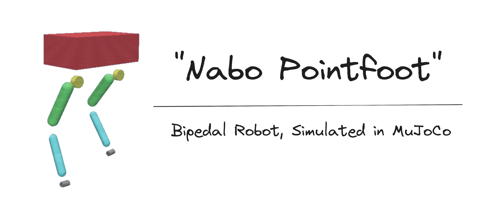
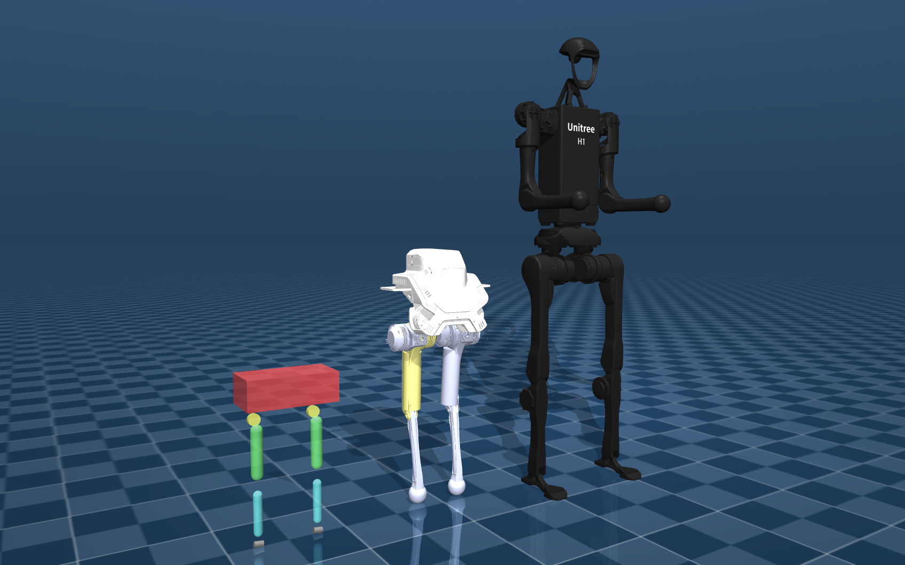

 

</a>

"<b>Na</b>ughty <b>bo</b>y Pointfoot" 🤖

    

  <a href="https://www.bilibili.com/video/BV1Cx4y1q76N/?spm_id_from=333.999.0.0&vd_source=489a733550a7c846fcce2e3eb3a683cc">视频</a> | <a href="https://github.com/tryingfly/nabo">Nabo</a> | <a href="https://github.com/SeaHI-Robot/Nabo_Pointfoot_Bipedal_Robot/blob/nabo_pointfoot_opensourced/README.md">English</a> 

 

 

## 简介

- Nabo Pointfoot 是一个点式双足的仿真框架，使用[**MuJoCo**](https://github.com/google-deepmind/mujoco)仿真引擎，代码全部由C++构建 

- Nabo Pointfoot 参考 [**nabo**](https://github.com/tryingfly/nabo),  一个12自由度的双足机器人的控制框架

- **MPC+WBIC** 组成了平衡控制器，控制器代码和仿真代码隔离，易于管理

- Nabo Pointfoot 行走身高 0.45米, 最大行走速度 **0.95m/s**.

 

## 特点

- 💻纯C++构建
- ⚡️计算效率高, MPC和WBIC的QP使用 [eiquadprog](https://github.com/stack-of-tasks/eiquadprog)求解
- 🤹交互式 [MuJoCo](https://github.com/google-deepmind/mujoco) UI界面
- 📝相比原[nabo](https://github.com/tryingfly/nabo)项目注释丰富

</a>

和 <b>LIMX P1</b> & <b>Unitree H1</b> 尺寸对比 🤖

 

## 使用说明

1. 本项目在Ubuntu20.04上开发完成, 不要在Windows上跑.
2. `$ git clone https://github.com/SeaHI-Robot/Nabo_Pointfoot_Bipedal_Robot.git`, 之后cd到该仓库的路径下.
3. `$ ./make_and_run` 来编译控制器和仿真的代码工程, 并打开方针UI界面. 
4. 完成编译 `nabo_core/` 和 `nabo_mujoco/` 目录下的仿真工程后，运行 `$ ./run_sim.sh` 可以只打开仿真界面.
5.  编辑 `nabo_mujoco/000.ini` 中的内容调整参数。`nabo_mujoco/zzz.txt` 负责储存仿真过程中的log文件，当启动log选项时。

> 在MuJoCo交互界面中：
>
> 按键:
> - w/s : 改变 x 方向目标速度
> - a/d : 改变 y 方向目标速度
> - j/l : 改变 z 方向目标角速度 
> - x: 所有目标速度设为0
> - backspace: 重置仿真
> - space: 暂停
> - f: 可视化足端接触力
> - z: 是否启动log

 

## 讨论

有任何问题请提 **Issue**, 或者加 QQ 群 609601974，该群为nabo原项目作者创建. 

 

## 致谢

1. [nabo](https://github.com/tryingfly/nabo),
2. [MIT mini-cheetah](https://arxiv.org/abs/1909.06586),
3. [MuJoCo](https://mujoco.org/) Simulator,

4. and SUSTech/南方科技大学🌈

</a>

